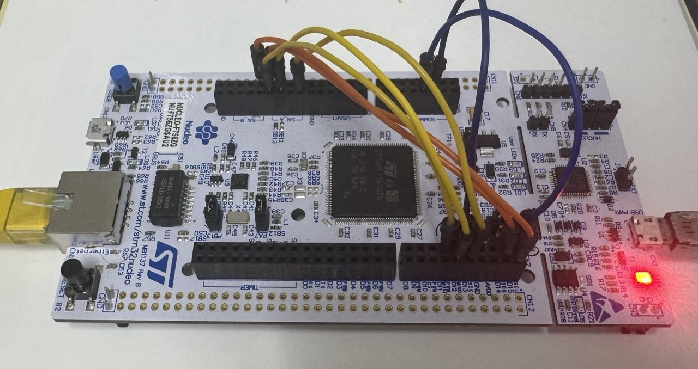
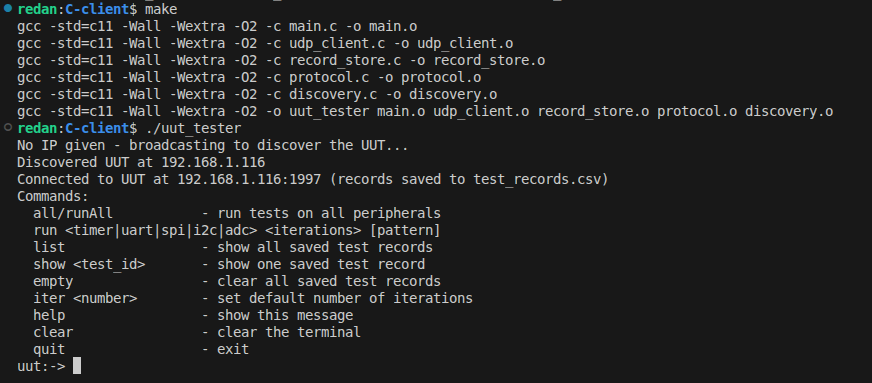
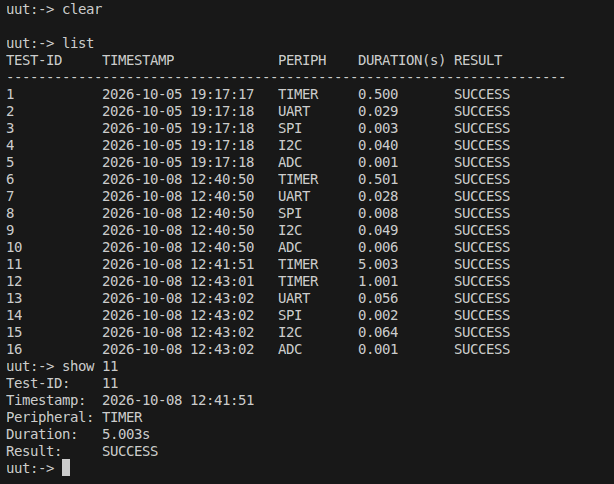

# STM32F756 Peripheral Hardware Tester

A client/server hardware verification system for the STM32F756ZG. A Linux command-line program (the server) sends test commands over **UDP/Ethernet** to the board (the UUT). The firmware runs the requested test on the selected peripheral and sends a pass/fail result back.

Final project for **SE Embedded Systems** (Real Time Group).

## Features

- Tests **Timer, UART, SPI, I2C and ADC**; the Ethernet MAC/PHY is exercised by the UDP link itself
- UART, SPI and I2C tests use **DMA** loopback between two on-chip instances
- **Hardware CRC-32** comparison for buffers larger than 100 bytes, plain byte compare otherwise
- Bare-metal **lwIP** stack (no RTOS) with DHCP
- Linux **C CLI** with persistent CSV test records and **automatic board discovery**

## How it works

```
┌─────────────────┐      UDP :1997       ┌──────────────────────────────────┐
│   Linux PC      │ ───────────────────► │   STM32F756ZG (UUT)              │
│   uut_tester    │   test command       │   lwIP → udp_config → test       │
│   (C-client/)   │ ◄─────────────────── │   module → peripheral loopback   │
└─────────────────┘   test result        └──────────────────────────────────┘
```

1. The client sends a command naming the peripheral, an iteration count and a bit pattern.
2. The firmware runs the test for that many iterations, stopping at the first failure.
3. The firmware replies with the test ID and a one-byte result.
4. The client records the test ID, timestamp, duration and result in `test_records.csv`.

## Requirements

**Firmware**

- NUCLEO-F756ZG board (STM32F756ZG) with an Ethernet connection to a network that provides DHCP
- STM32CubeIDE (and STM32CubeMX to edit the `.ioc`)
- Jumper wires for the loopback connections below

**Client**

- Linux, `gcc` and `make`
- Same local subnet as the board (needed for automatic discovery)

## Hardware setup

UART, SPI and I2C are tested by wiring two on-chip instances together. ADC and Timer use internal channels and need no pins or wiring.



Wire colors in the photo: **blue** = UART, **orange** = I2C, **yellow** = SPI. The Ethernet cable is on the left and the ST-LINK micro USB cable on the right.

### Pin map

| Test  | Instance | Role                     | Signal | Pin  |
| ----- | -------- | ------------------------ | ------ | ---- |
| UART  | UART4    | Sender / checker         | TX     | PC10 |
|       |          |                          | RX     | PC11 |
|       | USART6   | Echo                     | TX     | PC6  |
|       |          |                          | RX     | PC7  |
| SPI   | SPI4     | Master                   | SCK    | PE2  |
|       |          |                          | MISO   | PE5  |
|       |          |                          | MOSI   | PE6  |
|       | SPI1     | Slave                    | SCK    | PA5  |
|       |          |                          | MISO   | PA6  |
|       |          |                          | MOSI   | PB5  |
| I2C   | I2C1     | Master                   | SCL    | PB8  |
|       |          |                          | SDA    | PB9  |
|       | I2C2     | Slave (address `0x20`)   | SCL    | PF1  |
|       |          |                          | SDA    | PF0  |
| ADC   | ADC1     | Internal VREFINT channel | none   | none |
| Timer | TIM2     | Free-running counter     | none   | none |

### Wiring

| Test | Jumpers                                                                |
| ---- | ---------------------------------------------------------------------- |
| UART | PC10 → PC7 and PC6 → PC11 (TX to RX, crossed)                          |
| SPI  | PE2 ↔ PA5 (SCK), PE5 ↔ PA6 (MISO), PE6 ↔ PB5 (MOSI)                    |
| I2C  | PB8 ↔ PF1 (SCL), PB9 ↔ PF0 (SDA), with pull-up resistors on both lines |

### Peripheral settings

| Peripheral    | Settings                                                                                                                |
| ------------- | ----------------------------------------------------------------------------------------------------------------------- |
| UART4, USART6 | 115200 baud, 8 data bits, 1 stop bit, no parity, DMA                                                                    |
| SPI4 / SPI1   | Full duplex, 8-bit frames, CPOL high, CPHA second edge, software NSS, DMA. The master (SPI4) runs at APB2/8 = 13.5 MHz. |
| I2C1 / I2C2   | 7-bit addressing, DMA. The slave (I2C2) answers at `0x20`; the master's own address (`0x10`) is not used by the test.   |
| ADC1          | 12-bit, VREFINT channel, 480-cycle sampling at PCLK2/4 (27 MHz), DMA                                                    |
| TIM2          | 32-bit counter, 1 MHz tick (APB1 timer clock 108 MHz, prescaler register 107)                                           |

The UART, SPI and I2C pin assignments are also in the header comment of each test source file.

## Build and flash the firmware

1. Open STM32CubeIDE and choose **File → Import → Existing Projects into Workspace**, then select the repository root.
2. Build the project (`RTG/Inc` is already on the include path).
3. Flash the board over ST-LINK.
4. Open a serial terminal on the ST-LINK virtual COM port (**USART3, 115200**). The board prints its IP address once DHCP completes.

On boot the firmware initializes lwIP and the UDP server, then keeps servicing the network from the main loop.

## Build and run the client

```bash
cd C-client
make
./uut_tester                 # finds the board automatically
./uut_tester 192.168.1.50    # or give the board's IP explicitly
```

If no IP is given, the client broadcasts a small probe and uses the address of the board that replies. The last IP used is cached in `last_uut_ip.txt` and used as a fallback if discovery gets no reply.



### Client commands

| Command                                                   | Description                                               |
| --------------------------------------------------------- | --------------------------------------------------------- |
| `run <timer\|uart\|spi\|i2c\|adc> <iterations> [pattern]` | Run one test                                              |
| `all` / `runall`                                          | Run every peripheral test (a bare `run` does the same)    |
| `list`                                                    | Print all saved test records                              |
| `show <test_id>`                                          | Print one saved record                                    |
| `iter <number>`                                           | Set the default iteration count used by `all` (default 5) |
| `empty`                                                   | Delete all saved records                                  |
| `help` / `clear` / `quit`                                 | Show help / clear the screen / exit                       |

Running every test with `all`, a single Timer test with 50 iterations, and `all` again after raising the default with `iter 10`:



Listing the saved records with `list` and inspecting one with `show 11`:


Records are appended to `test_records.csv` as `test_id,timestamp,peripheral,duration_seconds,result`, so they persist between runs. Test IDs continue from the highest ID already on file.

## What each test does

| Test                 | Method                                                                                                                                                           | Pass criterion                                                                    |
| -------------------- | ---------------------------------------------------------------------------------------------------------------------------------------------------------------- | --------------------------------------------------------------------------------- |
| **UART / SPI / I2C** | The first instance sends the pattern by DMA, the second instance receives it and echoes it back, and the first instance compares what returns with what it sent. | Every iteration matches. The first mismatch or timeout fails the test.            |
| **ADC**              | Converts the internal VREFINT channel by DMA and compares it with the factory calibration value stored in flash.                                                 | Reading within ±`ADC_TOLERANCE` LSBs of the calibration value on every iteration. |
| **Timer**            | Free-runs TIM2 (1 MHz tick) for a 100 ms window timed by SysTick and checks the count.                                                                           | Count within ±2% of the expected value.                                           |

A comparison uses a direct byte compare for patterns of up to 100 bytes and the hardware CRC-32 above that. Iterations or pattern length of zero return success without touching the hardware.

## Protocol

UDP, port **1997**. Multi-byte fields use the sender's native **little-endian** byte order (no network-byte-order conversion on either side).

**Command (PC → UUT)**

| Field            | Size                   | Notes                                                         |
| ---------------- | ---------------------- | ------------------------------------------------------------- |
| `test_id`        | 4 bytes                | Echoed back in the reply                                      |
| `peripheral`     | 1 byte                 | `0x01` Timer, `0x02` UART, `0x04` SPI, `0x08` I2C, `0x16` ADC |
| `iterations`     | 1 byte                 | Number of test iterations                                     |
| `pattern_length` | 1 byte                 | Number of pattern bytes that follow (0–255)                   |
| `bit_pattern`    | `pattern_length` bytes | Data used by the UART, SPI and I2C tests                      |

**Result (UUT → PC)**

| Field         | Size    | Notes                          |
| ------------- | ------- | ------------------------------ |
| `test_id`     | 4 bytes | Matches the command            |
| `test_result` | 1 byte  | `0x01` success, `0xFF` failure |

Only the 7 fixed bytes plus `pattern_length` bytes are sent on the wire. Packets shorter than the header, or shorter than the length they declare, are silently dropped. An unrecognized peripheral byte gets an immediate `0xFF` reply, which the client also uses as its discovery probe.

## Project structure

```
.
├── ARM-Project-stm32f756-hardware-tester.ioc   CubeMX configuration
├── Core/            CubeMX-generated startup, HAL init and main.c
├── Drivers/         STM32 HAL / CMSIS
├── LWIP/            lwIP application and target glue (CubeMX)
├── Middlewares/     lwIP middleware
├── photos
│   ├── nu756zg.jpg
│   ├── pic.png
│   ├── pic2.png
│   ├── pic3.png
├── RTG/             Project firmware code
│   ├── Inc/
│   └── Src/
│       ├── udp_config.c        UDP server: parse command, dispatch, reply
│       ├── uart_test.c         UART loopback test
│       ├── spi_test.c          SPI loopback test
│       ├── I2c_test.c          I2C loopback test
│       ├── adc_test.c          ADC VREFINT test
│       ├── timer_test.c        Timer rate test
│       ├── data_compare.c      memcmp / hardware CRC-32 comparison
│       ├── dma_error_report.c  Shared DMA error diagnostics
│       ├── io_tools.c          printf/scanf redirected to USART3
│       └── user.c              Startup hook (starts the UDP server)
└── C-client/        Linux test program
    ├── main.c            CLI and test runner
    ├── udp_client.c      UDP send / receive with timeout
    ├── discovery.c       Broadcast discovery of the board
    ├── record_store.c    CSV record persistence
    ├── protocol.c        Wire structs and peripheral name mapping
    └── Makefile
```

## Configuration

Firmware constants live in `RTG/Inc/test_config.h`:

| Constant                                       | Default     | Meaning                                                     |
| ---------------------------------------------- | ----------- | ----------------------------------------------------------- |
| `TEST_TIMEOUT_MS`                              | 1000        | Wait for each DMA step before failing                       |
| `CRC_COMPARE_THRESHOLD`                        | 100         | Pattern length above which CRC-32 is used                   |
| `ADC_TOLERANCE`                                | 20          | Allowed deviation from the VREFINT calibration value (LSBs) |
| `TIMER_TEST_WINDOW_MS` / `TIMER_TOLERANCE_PCT` | 100 / 2     | Timer measurement window and tolerance                      |
| `I2C_SLAVE_ADDR`                               | `0x20 << 1` | I2C slave address                                           |

The UDP port is set in `RTG/Inc/udp_config.h` (`TEST_UDP_PORT`) and in `C-client/main.c` (`DEFAULT_PORT`). The two must match.

The timer constants (`TIM2_PSC`, `TIM2_INPUT_CLOCK_HZ`) must match the TIM2 settings in the `.ioc`.

## Limitations

- Tests run synchronously on the board, so it handles one request at a time. The client scales its reply timeout with the iteration count.
- UDP has no retransmission; an unanswered request is recorded as a failure.
- Automatic discovery uses broadcast, so it only works when the PC and board share a subnet. Pass the IP explicitly otherwise.
